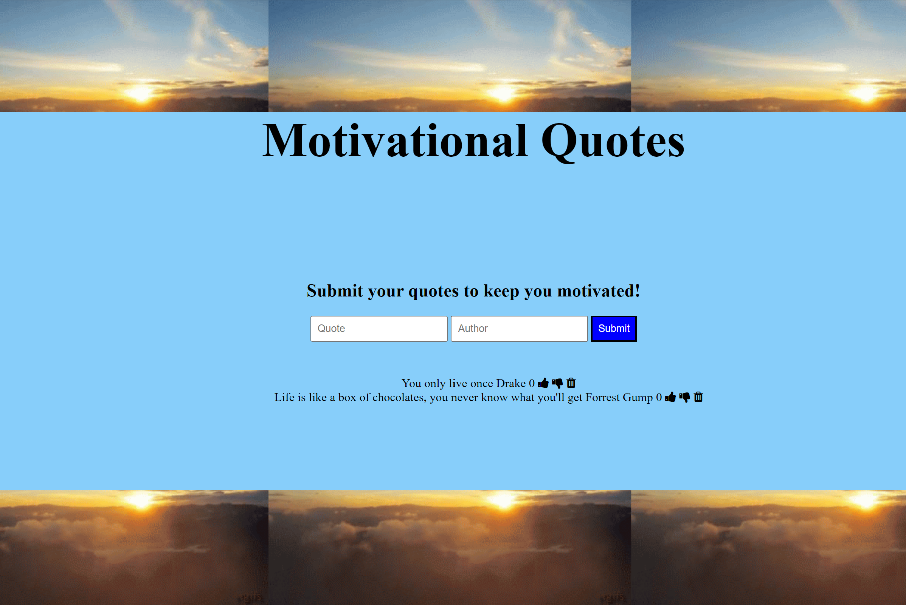

# Motivational Quotes Board w/ Express.js

### Goal: Create a motivational quotes board using Express. 

## Web application intended for anyone to leave motivational quotes they use to help stay on top of tasks. The application is connected to a Node.js server and MongoDB database. 

*Project completed using HTML, CSS, Javascript, Node.js, Express.js, MongoDB.*

## Installation

1. Clone repo
2. run `npm install`

## Usage

1. run `node server.js`
2. Navigate to `localhost:9000`
